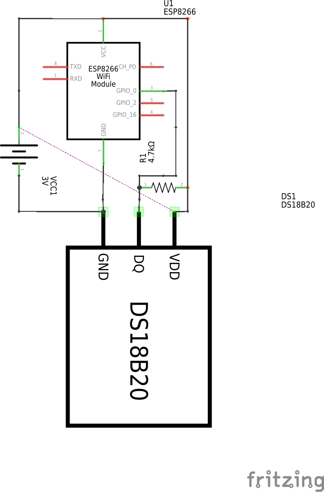
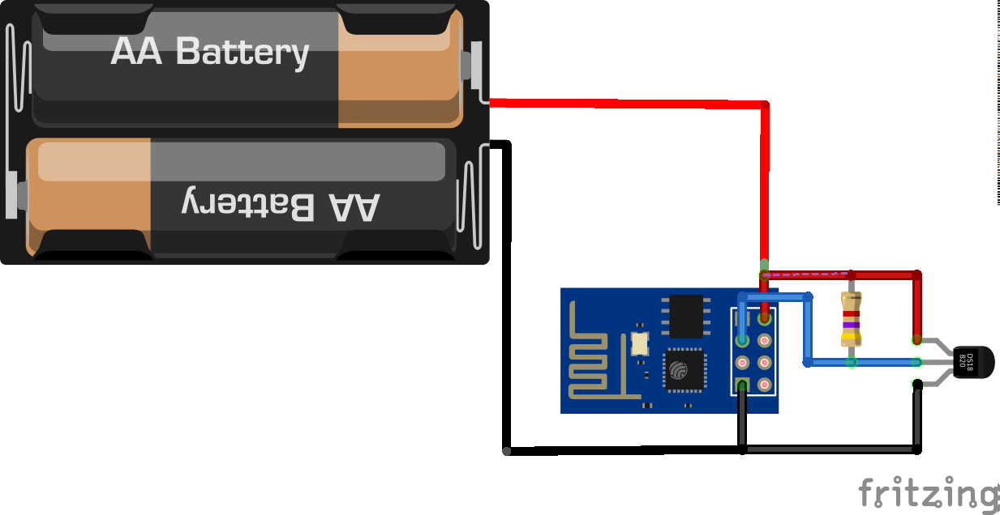

# esp8266-nodemcu-ds18b20
Be careful ! VCC and GND on schemes are confused. You can burn your DS18B20 or ESP8266.

Simple temperaturelogger to report temperature to thingspeak.com every minute.

Built with esp8266 and ds18b20, running on nodemcu.

