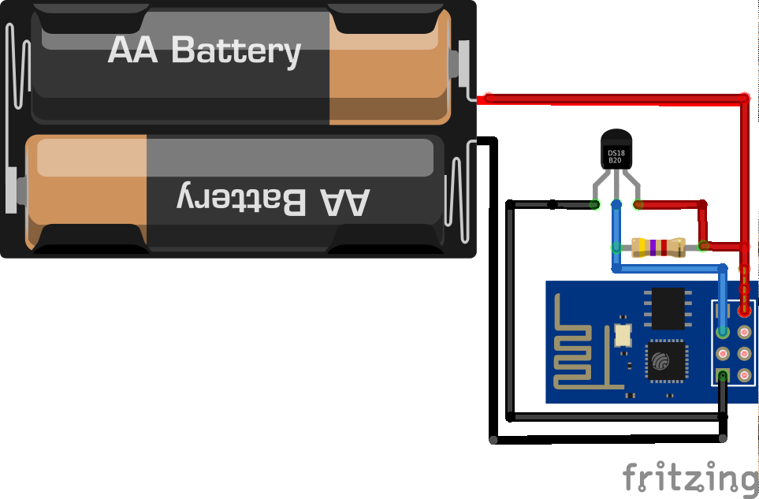

# esp8266-nodemcu-ds18b20

Simple temperaturelogger to report temperature to thingspeak.com every minute.

Built with esp8266 and ds18b20, running on nodemcu.

More at http://vaasa.hacklab.fi/2015/01/12/esp8266-ds18b20-thingspeak-nodemcu/

